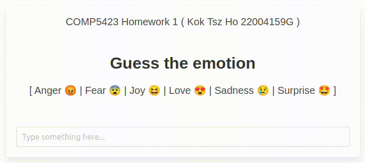

# COMP5423 NLP Homework 1

## Student Information:  
- Kok Tsz Ho Zelca
- 22004159G

## Project Repository
- Please visit <a href="https://github.com/zelcakok-22004159G/COMP5423-emotion-classification">https://github.com/zelcakok-22004159G/COMP5423-emotion-classification</a> for viewing the readme.

## Project Structure
|Category|Filename|Description|
|--------|--------|-----------|
|Data Pre-processing|stopwords.py|Generate stopwords from the datasets using TF-IDF
|Data Pre-processing|preprocess.py|Perform stemming and lemmation on datasets.
|Training|index.ipynb|Jupyter Notebook for Colab
|Training|index.py|For local debugging use
|Evaluation|evaluation.py|Use the trained model to classify the testing dataset and output the submission.csv
|API Service|interface.py|Flask APIs for web UI integration
    
## Prerequisite
- NodeJS version >= 12.0.0
    - Installed the `Yarn` library
- Python version >= 3.8
    - Installed the `venv` library
- Make sure the following files are located in the `data` folder
    - train_data.txt
    - val_data.txt
    - test_data.txt

## Init Project Environment
```bash
# Create the virtual env
python -m venv venv

# Activate the virutal env
source venv/bin/activate

# Install the dependencies
pip install -r requirements.txt

# Test the dependencies
python -c "import torch; print('Is CUDA supported? ', torch.cuda.is_available())"

# If ModuleNotFoundError: No module named 'torch' error is raised
# make sure you have activated the virtual environment
```

## How to use this project

### Generate stopwords
- Make sure the virtual environment is activated
- Run `python stopwords.py`
    - A file `stopwords.txt` will be generated in the `data` folder
    - You may use `tail data/stopwords.txt` to check it

### Pre-process the training and validation datasets
- Make sure the virtual environment is activated
- Run `python preprocess.py`
    - Two files will be generated in the `data` folder
        - `data/train_data_trimmed.txt`
        - `data/val_data_trimmed.txt`
    - You may use `tail data/train_data_trimmed.txt` to check it

### Train the model
- Make sure the virtual environment is activated
- Edit the line 33 in the `index.py`
    - `device = "cpu" # Use CPU to train`
    - `device = "cuda" # Use GPU to train`
- Run `python index.py`
    - The model will be outputed in the `model` folder

### Evaluate the model
- Make sure the virtual environment is activated
- Edit the line 7 in the `evaluation.py`
    - Fill in the folder that contains the testing model
        - `model_folder "model"` # model is the folder name
- Run `python evaluation.py`
    - The result named `submission-{model-name}.csv` will be generated in the project root folder.

### Starting the UI module
- Make sure the virtual environment is activated
- Edit the line 9 in the `interface.py`
    - `model_folder = "model"` # model is the folder name
- Start the API server
    - `python interface.py`
    - Wait until you see something like 
        - `* Running on http://127.0.0.1:5000`
- Start the Web server
    - `cd web & yarn && yarn serve`
    - Wait until you see something like 
        - `Local:   http://localhost:8080/`
- Navigate to <a href="http://localhost:8080">http://localhost:8080</a> and you should see the following screen
<br>


